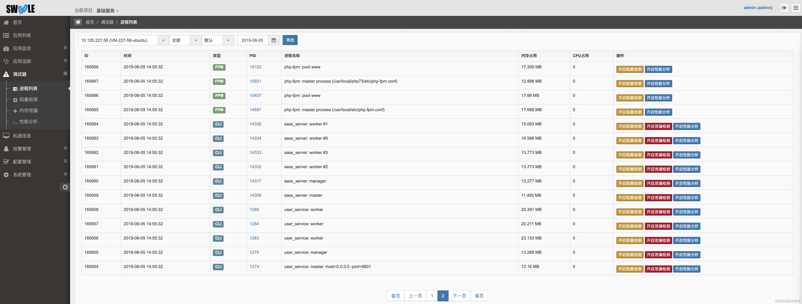
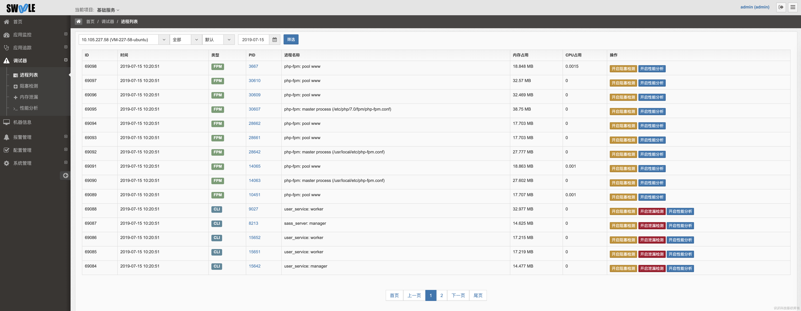

# 调试器
[TOC]
## 进程列表

统计客户端fpm和cli的pid，可进行远程调试、pid进程CPU和内存占用统计

## 远程调试

对于以下三种工具，可以直接在服务端点击按钮远程开启后进行调试，无需修改代码，重启服务。开启后发生请求，日志自动上传服务端后台进行分析展示

>[danger] 对性能有所影响，开启调试完毕后请及时关闭。

### 阻塞检测

可详细看到阻塞的堆栈信息，执行耗时，系统调用信息

### 内存泄漏

会获取到存在内存泄漏的文件堆栈信息，说明你需要在代码逻辑执行完毕后将该键名 `unset` 掉，就可以解决内存泄漏问题

### 性能分析

性能分析可以生成分层分析表、调用图和火焰图，都可以直观的找到对应的瓶颈所在

#### 分层分析表

#### 调用图

#### 火焰图

